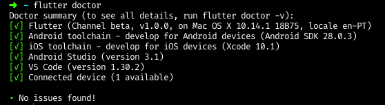

# Flutter Workshop: *Setup*

## System Requirements

Check the following links for the system requirements for your operating system before you start.

- [Windows](https://flutter.io/docs/get-started/install/macos#android-setup)
- [MacOS](https://flutter.io/docs/get-started/install/macos#system-requirements)
- [Linux](https://flutter.io/docs/get-started/install/linux#system-requirements)

Note: you will require access to a MacOS to be able to build for iOS or using an online CI*

## You will also need

Have at least one of the following:

- A device connected to your SO, an Android or an iOS
- Android emulator.
- iOS emulator.

## Install Flutter

Go to the oficial website <flutter.dev> for installation instructions. Start by picking your operating system of choice.

Install <https://flutter.io/docs/get-started/install>

*Note: While Flutter relies to have full Android Studio installed because of dependencies, you do not need to develop Flutter in it. In fact our editor of choice will be Visual Studio Code.*

## VSCode Editor

The editor of choice will be Visual Studio Code ( [install](https://code.visualstudio.com/) ), there are instructions in the oficial website, make sure you install the Flutter and Dart plugin for VSCode.

Install <https://flutter.io/docs/get-started/editor?tab=vscode>

### Recomended VSCode Plugins

We also recomend that you install the following plugins.

- [Awesome Flutter Snippets](https://marketplace.visualstudio.com/items?itemName=Nash.awesome-flutter-snippets) - Just a bunch of more common snippets shortcuts
- [GitLens](https://marketplace.visualstudio.com/items?itemName=eamodio.gitlens) - Git helper to better version your work
- [Rainbow Brackets](https://marketplace.visualstudio.com/items?itemName=2gua.rainbow-brackets) - Makes the brackets colorful and easier to track (you'll need it)
- [Pubspec Assist](https://marketplace.visualstudio.com/items?itemName=jeroen-meijer.pubspec-assist) - Helps add new dependencies
- [dart-import](https://marketplace.visualstudio.com/items?itemName=luanpotter.dart-import) - Turns your imports to relative paths

## Check Installation

### Flutter Doctor

Run command ```flutter doctor``` in your console and you should have mostly everything with a green check mark.



Troubleshooting:

- Have at least one toolchain for developing iOS or Android
- Having 'licensing problems' you can try the command ```flutter doctor --android-licenses```
- It's recommended that you to use Java 8, for set up you can install [SDKMAN](https://sdkman.io/)
- Problems using the android emulator? Don't for get to set ut the ```$ANDROID_SDK_ROOT```
- If you are using and android connected over USB and it is not detected:
  - Install ["Android File Transfer"](https://www.android.com/filetransfer/)
  - Check for your model if need any software installed
  - Restart the ADB by running the following command ```adb kill-server```
  - Try a different USB cable

## Dart 2.1.0

While we will be developing in Dart, if you are experienced developer in another programming language, you will find it easy to start. We will mostly use Flutter Widgets but if you would like to know more about Dart, or if you need to learn how to do something in Dart. I recommend you check the following websites

- Learn X in Y minutes (Dart) - <https://learnxinyminutes.com/docs/dart/>
- Dartlang Language Tour - <https://www.dartlang.org/guides/language/language-tour>
- Dartlang Samples - <https://www.dartlang.org/samples>
- Devdocs (Dart) - <https://devdocs.io/dart~2/>
- DartPad - <https://dartpad.dartlang.org/>

## Flutter

- Flutter Documentation - <https://docs.flutter.dev/>
